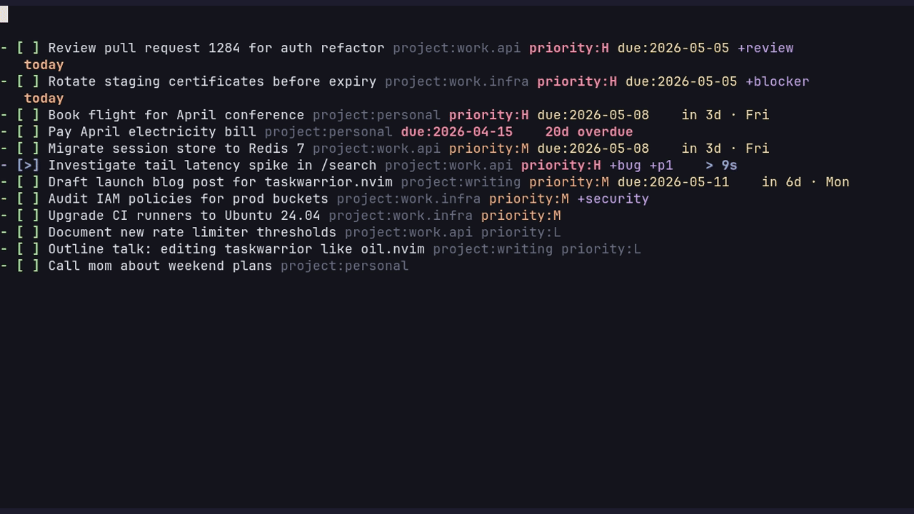

# 📋 taskwarrior.nvim

> Edit your Taskwarrior database like a Neovim buffer. Every vim motion, macro, and visual-mode operation becomes a task management operation. Inspired by [oil.nvim](https://github.com/stevearc/oil.nvim).

<p>
<a href="https://github.com/MattHandzel/taskwarrior.nvim/releases"></a>
<a href="https://github.com/MattHandzel/taskwarrior.nvim/commits/main"></a>
<a href="https://github.com/MattHandzel/taskwarrior.nvim/blob/main/LICENSE"></a>
<a href="https://github.com/MattHandzel/taskwarrior.nvim/stargazers"></a>
<a href="https://github.com/MattHandzel/taskwarrior.nvim/issues"></a>
</p>



```
:Task                                   -- open all pending tasks
V20j:s/project:Inbox/project:career/    -- reassign 20 tasks
dd                                      -- mark task done
o                                       -- add new task inline
:w                                      -- sync all changes at once
```

## ✨ Features

- 📝 **Edit as markdown** — `:Task` opens your Taskwarrior database as a buffer; every vim motion is a task operation
- 🔁 **Bulk edits via `:s///`** — visual-select 20 tasks, substitute the project, `:w` applies them all in one round-trip
- 🛡️ **Conflict-aware save** — diffs your edits against fresh Taskwarrior state on every `:w`; external `task add` / `task modify` between render and save is preserved, not clobbered
- ⚡ **Quick capture from any buffer** — `<leader>ta` floats a one-line capture in any buffer
- 🔍 **Live query blocks in arbitrary markdown** — `<!-- taskmd query: due.before:eow -->` renders matching tasks below it on save; embed live task lists in your project's `notes.md`
- 📊 **Built-in visualizations** — burndown, dependency tree, per-project summary, calendar, tag frequency, Mermaid graph
- 🎯 **Guided review + GTD inbox** — `:TaskReview` walks pending tasks in urgency order; `:TaskInbox` triages new captures
- 🤖 **Delegate to Claude** — `:TaskDelegate` opens a popup form and runs the task as a Claude prompt in a bottom split
- 🎓 **Interactive tutor** — `:TaskTutor` teaches Taskwarrior + the plugin from scratch in 20 minutes, fully sandboxed (your real `~/.task` is never touched)
- 🚀 **Pure-Lua hot path, zero runtime deps** — optional Python CLI in `bin/taskmd` for scripting and pipelines
- 🧪 **480+ tests** — Python CLI, Lua backend, end-to-end against a real `task` binary including external-write conflict scenarios

## ⚡ Requirements

- Neovim ≥ 0.9
- Taskwarrior ≥ 2.6 (compatible with 3.x)
- Python ≥ 3.8 — *optional*, only for the `bin/taskmd` CLI and live diff-preview virt-text. The default render/save path is pure Lua.

## 📦 Installation

```lua
-- lazy.nvim
{
  "matthandzel/taskwarrior.nvim",
  config = function()
    require("taskwarrior").setup()
  end,
}
```

> **Already use [Shatur/neovim-tasks](https://github.com/Shatur/neovim-tasks) (or any other plugin that registers `:Task`)?** Override our prefix before the plugin loads:
>
> ```lua
> {
>   "matthandzel/taskwarrior.nvim",
>   init = function() vim.g.taskwarrior_command_prefix = "Tw" end,
>   config = function() require("taskwarrior").setup() end,
> }
> ```
>
> Now every command is `:Tw*` (`:Tw`, `:TwFilter`, `:TwInbox`, …) and Shatur's `:Task` keeps working. The plugin emits a one-shot WARN at startup if it detects a collision so you'll know to override.

## 🚀 Quick start

```
:Task                          -- view all pending tasks
:Task project:career +ais      -- filter
:Task due.before:eow           -- tasks due this week
```

Edit any line. `:w` to sync. That's it.

## 🎓 New to Taskwarrior? Run the tutor

```
:TaskTutor
```

A 5-lesson, ~20-minute interactive walkthrough that teaches the Taskwarrior CLI from scratch and graduates you into the plugin's buffer-as-database UX. Fully sandboxed — every command runs against a throwaway DB in `/tmp`, your real `~/.task` and `~/.taskrc` are never touched. The tutor cleans up after itself when you finish, quit (`q`), or close the buffer.

Prefer video? Andrew Dumont's [Taskwarrior intro on YouTube](https://www.youtube.com/watch?v=5wmcn9-IQE4) is a great 8-minute primer; come back to `:TaskTutor` after.

If `task` is missing on your system, the tutor's first lesson points you at the right install command for your package manager. Or run `:checkhealth taskwarrior` to verify your environment.

### Sandbox guarantees

The tutor runs every `task` command with `rc.data.location=<temp>` and `rc.hooks=off`, and the `[Tutor shell]` terminal split spawns `bash --norc --noprofile` with `TASKDATA`/`TASKRC` env scoped to the temp dir. The structural invariants are tested in [`tests/lua/spec/tutor_isolation_spec.lua`](tests/lua/spec/tutor_isolation_spec.lua) and [`tests/lua/spec/tutor_lessons_spec.lua`](tests/lua/spec/tutor_lessons_spec.lua) — together they make it impossible for a future code change to silently bypass the sandbox.

`:TaskTutor reset` ends an active session and cleans up any orphan temp dirs left by a prior crash.

## Compared to other Neovim Taskwarrior plugins

| Plugin | Approach | Where this plugin differs |
|---|---|---|
| [m_taskwarrior_d.nvim](https://github.com/huantrinh1802/m_taskwarrior_d.nvim) | Sync `- [ ]` checkboxes embedded in your existing markdown notes | This plugin gives you a **dedicated buffer** for the database itself; pure-Lua render path (no per-task shell spawn freeze); conflict-aware diff; ships `:TaskTutor` |
| [neowarrior.nvim](https://github.com/duckdm/neowarrior.nvim) | Sidebar TUI with tree views, named reports, per-cwd configs | This plugin treats the database as a **buffer you edit with vim motions**, not a TUI you navigate with custom keys; picker-agnostic (works without Telescope); ships `:TaskTutor` |
| [ribelo/taskwarrior.nvim](https://github.com/ribelo/taskwarrior.nvim) | Telescope picker + per-project `.taskwarrior.json` auto time-tracking | This plugin is markdown-buffer first; Telescope is an optional layer, not the primary UI; actively maintained; ships `:TaskTutor` |
| [TaskWiki](https://github.com/tools-life/taskwiki) | Vimwiki extension with task-syntax checkboxes | This plugin is Neovim-native (no vimwiki dep), supports Taskwarrior 3.x, ships an automated test suite, and ships `:TaskTutor` |

The interactive tutor is unique to this plugin — no other Neovim Taskwarrior integration ships one.

---

<details>
<summary><strong>📸 Showcase</strong> — visualizations, quick capture, guided review, delegation, diff preview</summary>

### Browse, filter, group


`:TaskFilter project.startswith:work` narrows to a project. `:TaskGroup project` splits the buffer into `## sections`. `:TaskSort due+` re-sorts within groups. None of this touches your Taskwarrior database — only the view.

### Quick-capture from any buffer


`<leader>ta` pops a floating window in any buffer. Type `Fix auth bug project:work priority:H`, press Enter, go back to what you were doing. The task is in Taskwarrior before your hand leaves the keyboard.

### `:TaskBurndown` — completion trend over time


ASCII bar chart of pending-task count by date. Reads `entry` and `end` dates from every task you've ever created, samples to fit the buffer width, color-codes by remaining height (red high → green low). Useful for "am I actually closing tasks faster than I'm opening them?"

### `:TaskTree` — dependency graph


Renders `depends:` relationships as an indented tree. Top-level tasks are roots; `└──` and `├──` connectors show parentage. Urgency score on the right is color-coded (red ≥8, orange ≥4, green below). Dead-simple way to find the leaf tasks that are unblocking everything else.

### `:TaskSummary` — per-project stats


For each project: pending count, done count, overdue count, high-priority count, and a horizontal bar. Bar color is red if any task is overdue, orange if any is high-priority, blue otherwise. Footer shows total completion rate.

### `:TaskCalendar` — by due date


Pending tasks grouped by due date, ordered chronologically. Today is marked `← TODAY`, overdue dates marked `⚠ OVERDUE`. Tasks under each date show priority (`!H`/`!M`/`!L`) and project (`@name`).

### `:TaskTags` — tag frequency


Every tag on every pending task with a count and frequency bar. Quick way to see which tags you're actually using vs. which were one-offs.

### `:TaskReview` — guided urgency walk


Walks pending tasks in urgency order. For each task: `k` keep, `d` defer, `D` mark done, `m` modify, `g` jump to it in the main buffer, `q` quit. Useful for the "weekly tidy" pass where you want to look at every urgent task and decide what to do with it without opening a separate buffer.

### `:TaskDelegate` — hand a task to Claude


Opens a popup form (extra context, flags, model, system-prompt-file) and runs Claude in a visible bottom split. Visual-range support: `V` to select multiple task lines, then `:TaskDelegate` delegates them all in one Claude session. `:TaskDelegate copy` and `:TaskDelegate copy-command` copy the assembled prompt or the full shell invocation to the `+` register without spawning anything.

### `:TaskDiffPreview` — see edits before you save


Toggle with `:TaskDiffPreview on`. As you edit, virtual-text labels appear at end-of-line: `+ ADD`, `~ MODIFY`, `✓ DONE`, `✗ DELETE`, `▶ START`, `◼ STOP`. 400ms debounce keeps it from running on every keystroke. Same data the `:w` confirmation dialog uses — just shown live.

</details>

---

## Conflict-aware save path

The buffer is a snapshot of `task export` at the moment you opened it. When you `:w`, the plugin re-exports the current Taskwarrior state and diffs your edits **against current state**, not against what you saw. This means:

- A task someone else added between render and save is preserved — your edits don't silently mark it done.
- A field added externally (`task X modify foo:bar` from another window or a sync) survives your save.
- A task externally completed isn't resurrected as pending just because its checkbox is still rendered in your buffer.
- A genuine conflict (you and an external writer both changed the same field) surfaces in the confirmation dialog instead of being silently overwritten.
- `:w!` skips the conflict check — destructive escape hatch when you know what you're doing.

The full external-write matrix is verified in `tests/e2e/spec/external_changes_spec.lua` against a real `task` binary on every commit.

## Auto-project filter from cwd

Register the directories you work in:

```
:TaskProjectAdd career      -- maps cwd to project:career
:TaskProjectList            -- show all mappings
:TaskProjectRemove          -- unmap cwd
```

After that, `:Task` (with no filter) auto-applies `project:<name>` whenever you launch it from inside a registered directory. Persisted to `stdpath("data")/taskwarrior_nvim_projects.json`.

## Ecosystem

These are bundled but require their own host plugins.

| Module | Path | Activate |
|---|---|---|
| Telescope picker | `lua/telescope/_extensions/task.lua` | `require("telescope").load_extension("task")` then `:Telescope task tasks` |
| nvim-cmp source | `lua/taskwarrior/cmp.lua` | `require("cmp").register_source("task", require("taskwarrior.cmp").new())` then add `{ name = "task" }` to your cmp sources |
| Statusline component | `lua/taskwarrior/statusline.lua` | `require("taskwarrior.statusline").render()` — returns a string with the active task / overdue count / next due |

## All commands

| Command | Description |
|---|---|
| `:Task [filter]` | Open task buffer with optional Taskwarrior filter |
| `:TaskFilter [filter]` | Change filter on current buffer |
| `:TaskSort <spec>` | Change sort order (e.g. `due+`, `urgency-`, `priority-`) |
| `:TaskGroup [field]` | Change grouping (`project`, `tag`, or `none`) |
| `:TaskRefresh` | Reload from Taskwarrior |
| `:TaskAdd` | Quick-capture a task (floating window) |
| `:TaskUndo` | Reverse last save's changes |
| `:TaskHelp` | Show all commands, keybindings, syntax |
| `:TaskStart` / `:TaskStop` | Start / stop active timer on task under cursor |
| `:TaskSave <name>` / `:TaskLoad [name]` | Save / restore the current filter+sort+group as a named view |
| `:TaskReview` | Guided urgency walk through pending tasks |
| `:TaskDelegate [copy\|copy-command]` | Delegate task(s) to Claude in a popup form |
| `:TaskDiffPreview [on\|off\|toggle]` | Toggle live virt-text diff preview |
| `:TaskBurndown` | Pending-task burndown chart |
| `:TaskTree` | Dependency tree |
| `:TaskSummary` | Per-project stats |
| `:TaskCalendar` | Tasks grouped by due date |
| `:TaskTags` | Tag-frequency view |
| `:TaskProjectAdd [name]` / `:TaskProjectRemove` / `:TaskProjectList` | Auto-project mapping |
| `:TaskTutor [reset]` | Open the interactive tutorial; `reset` ends an active session and cleans up orphan temp dirs |

## Keybindings (buffer-local)

| Key | Action |
|---|---|
| `<CR>` | Toggle task complete/pending |
| `o` | New task below |
| `O` | New task above |
| `dd` | Delete task (marks done on save by default) |
| `yy` + `p` | Duplicate task |
| `ga` | Add annotation |
| `gf` | View formatted `task info` |
| `<leader>ta` | Quick-capture (global, works from any buffer) |
| `<leader>tt` | Open task buffer (global) |
| `<leader>tf` | Change filter (in task buffer) |
| `<leader>ts` | Change sort (in task buffer) |
| `<leader>tg` | Change group (in task buffer) |
| `<leader>tpa` | Register cwd as a project |

## Metadata syntax

Tasks use Taskwarrior-native syntax after the description:

```
- [ ] Fix login bug project:Work priority:H due:2026-04-01 +urgent +backend
```

**Fields:** `project:`, `priority:` (H/M/L), `due:`, `scheduled:`, `recur:`, `wait:`, `until:`, `effort:`, `depends:`

**Tags:** `+tagname` (supports hyphens: `+my-tag`)

**UDAs:** Custom fields are auto-discovered from your Taskwarrior config (`task _udas`) and serialized inline. Verified: render, edit, save round-trip on both backends.

## Configuration

```lua
require("taskwarrior").setup({
  on_delete = "done",          -- "done" or "delete" when lines are removed
  confirm = true,              -- show confirmation dialog before applying
  sort = "urgency-",           -- default sort (field+ for asc, field- for desc)
  group = nil,                 -- default group field (nil to disable)
  fields = nil,                -- fields to show (nil = all)
  capture_key = "<leader>ta",  -- global quick-capture (nil to disable)
  open_key = "<leader>tt",     -- global open-task-buffer (nil to disable)
  filter_key = "<leader>tf",   -- buffer-local filter (nil to disable)
  sort_key = "<leader>ts",     -- buffer-local sort
  group_key = "<leader>tg",    -- buffer-local group
  project_add_key = "<leader>tpa",  -- register cwd as a project
  filters = {},                -- named filter presets (see :h)
  projects = {},               -- directory-to-project mapping
  icons = true,                -- nerd font checkbox/header icons
  border_style = "rounded",    -- "rounded" | "single" | "double" | "none"
  capture_width = nil,         -- quick-capture width (nil = auto)
  capture_height = 3,          -- quick-capture height in lines
  auto_backup = true,          -- copy ~/.task to stdpath("data")/taskwarrior.nvim/backups/ before apply
  auto_backup_keep = 10,       -- number of recent backups to retain
  delegate = {
    command = "claude",
    flags = "",                -- e.g. "--dangerously-skip-permissions" (opt-in)
    model = nil,
    system_prompt_file = nil,
    height = 0.5,
  },
})
```

### Custom urgency with UDAs

If you have custom UDA fields (e.g. `utility`, `effort`) and want them to affect task sort order, use `urgency_coefficients`. For each field, the urgency adjustment is **value × coefficient** — proportional to the actual numeric value, not just whether the field is present:

```lua
require("taskwarrior").setup({
  urgency_coefficients = {
    utility = 1.0,     -- utility:8 adds +8, utility:20 adds +20
    effort = -0.5,     -- effort:60 subtracts -30 (do easy wins first)
  },
})
```

The default is `{}` (no adjustments) — set only the fields you use.

For non-linear urgency (e.g. `log(utility)` or `utility / effort`), use `custom_urgency` — a Lua function that receives the full task table and returns a number:

```lua
require("taskwarrior").setup({
  custom_urgency = function(task)
    local base = task.urgency or 0
    local utility = tonumber(task.utility) or 0
    local effort = tonumber(task.effort) or 60
    return base + math.log(utility + 1) * 3 - math.sqrt(effort) * 0.1
  end,
})
```

## How it works

1. `:Task` runs the Lua backend (`lua/taskwarrior/taskmd.lua`) which calls `task export`, parses the JSON, and renders markdown checkboxes with concealed `<!-- uuid:ab05fb51 -->` markers.
2. You edit the buffer with standard vim operations.
3. On `:w`, the plugin diffs your edits against fresh Taskwarrior state.
4. A confirmation dialog shows what will change (`:TaskDiffPreview on` shows it live as you type).
5. Changes are applied via `task modify` / `task done` / `task add` / `task delete`.
6. The buffer re-renders from Taskwarrior truth.

UUID markers are invisible thanks to `conceallevel=3` + `concealcursor`, and survive any vim operation that preserves the line.

## Health check

Run `:checkhealth taskwarrior` to verify your setup (Neovim version, Taskwarrior CLI, optional Python, `taskmd` binary, data directory).

## CLI usage

The bundled `taskmd` CLI is optional and works standalone for scripting and automation:

```bash
taskmd render project:Inbox --sort=due+      # markdown to stdout
taskmd render --group=project                # grouped view
taskmd apply tasks.md                         # sync edits back
taskmd apply tasks.md --dry-run              # preview changes as JSON
taskmd completions                            # JSON for editor completion
```

Useful for: piping rendered tasks through `grep`/`fzf`, automating bulk operations from shell scripts, integrating with non-vim editors.

## Data safety

> **Status: Beta.** Usable day-to-day, but APIs and defaults may still change before 1.0. Always keep an external backup of your Taskwarrior data (`cp -r ~/.task ~/.task.bak`); review the confirmation dialog before saving — `:w` issues real `task modify` / `task done` / `task delete` commands.

`:w` issues real `task modify` / `task done` / `task add` / `task delete` commands against your Taskwarrior database. There is no staging.

By default (`auto_backup = true`), the plugin copies your Taskwarrior data directory to `stdpath("data")/taskwarrior.nvim/backups/<timestamp>/` immediately before any apply. The ten newest backups are kept; older ones are pruned. Disable with `auto_backup = false` in `setup()`.

The CLI also refuses to `apply` a file with a missing or malformed header unless you pass `--force`, preventing the "hand-wrote a file, got every pending task marked done" failure mode.

**You should still keep an external backup of `~/.task`.** The plugin's backups are a convenience, not a replacement.

## Migrating from `task.nvim`?

This plugin was renamed in v1.3.0. Update your lazy.nvim spec from `matthandzel/task.nvim` to `matthandzel/taskwarrior.nvim` and replace `require("task")` with `require("taskwarrior")` in your config. The `:Task*` commands and the `taskmd` filetype are unchanged. Saved views, registered projects, and apply backups migrate automatically the first time the plugin loads.

## Help

Run `:help taskwarrior.nvim` inside Neovim for the full reference, or read [`doc/taskwarrior.txt`](doc/taskwarrior.txt). `:checkhealth taskwarrior` verifies your setup.

## Contributing

See [CONTRIBUTING.md](CONTRIBUTING.md). Quick version:

```bash
python3 -m pytest tests/ -v        # 358 tests, stdlib-only CLI
./tests/lua/bootstrap.sh           # 121 Lua assertions via plenary
./tests/e2e/run.sh                 # end-to-end against real `task` binary
```

Every bug fix needs a regression test. The Python suite covers the `bin/taskmd` CLI; the Lua suite covers the in-editor backend; the e2e suite drives every feature against a real `task` CLI and validates downstream output.

## Changelog

See [CHANGELOG.md](CHANGELOG.md).

## License

MIT
