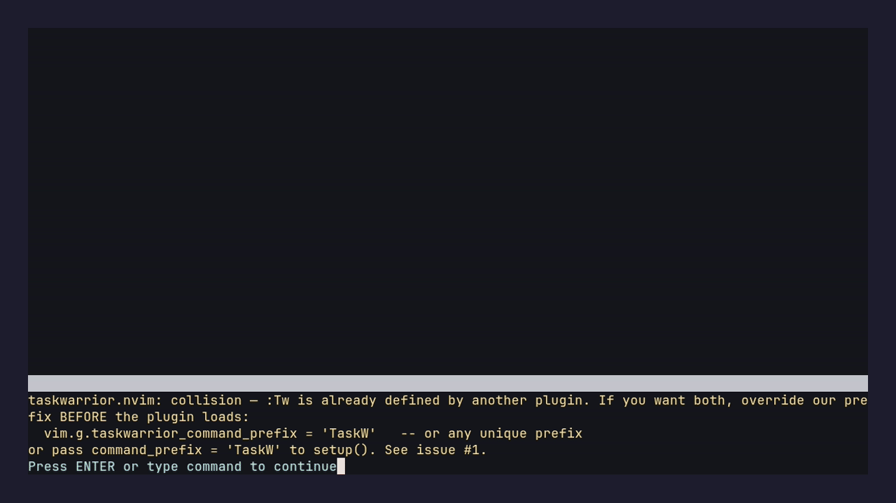
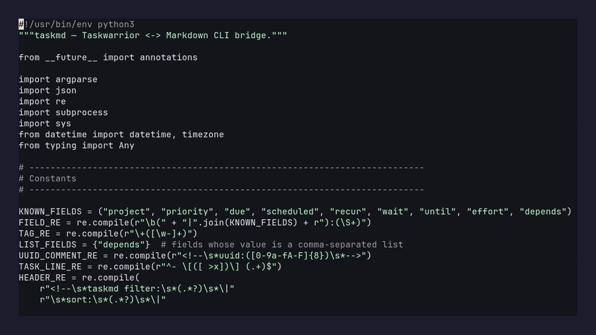
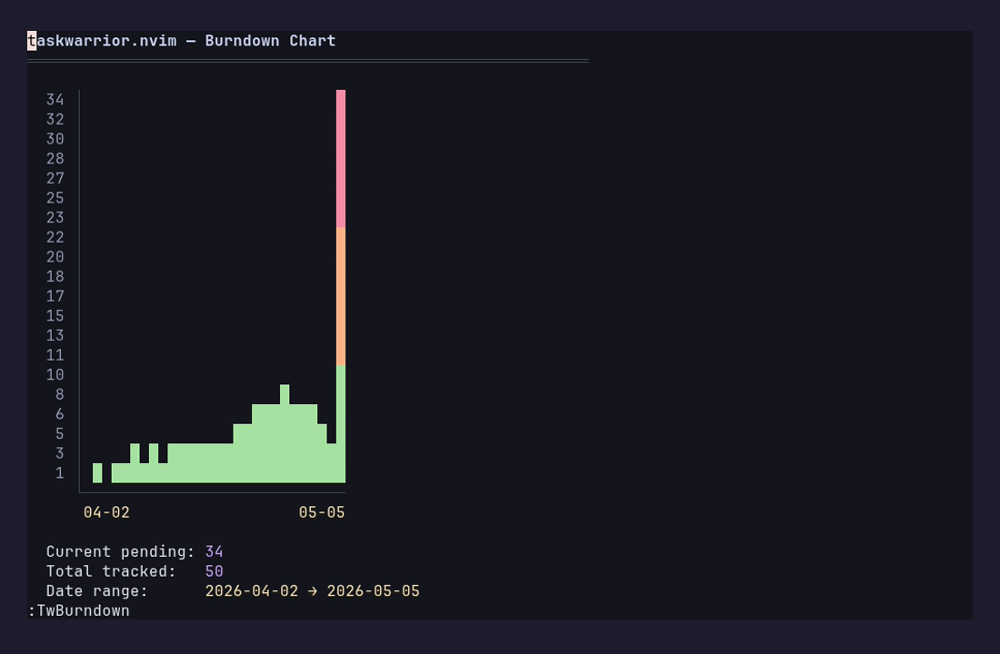
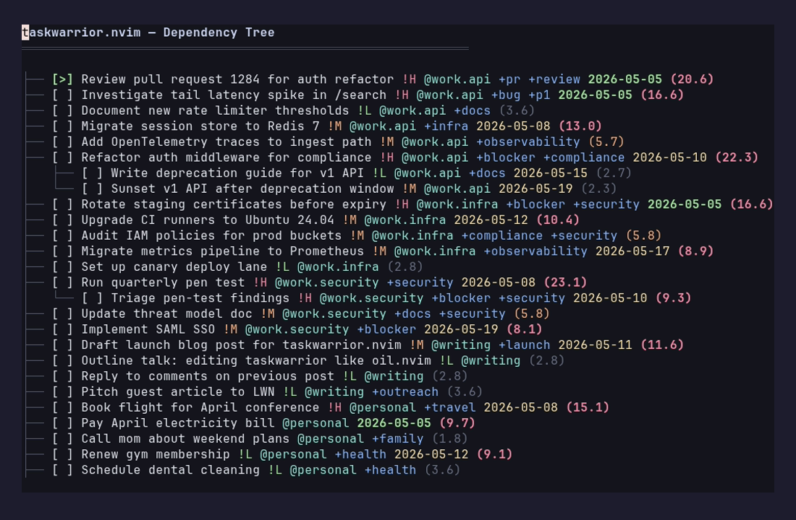
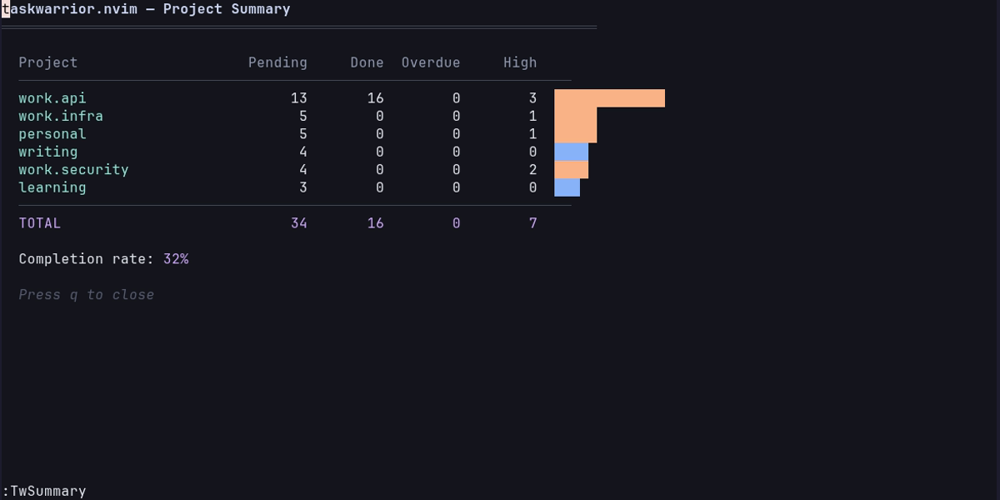
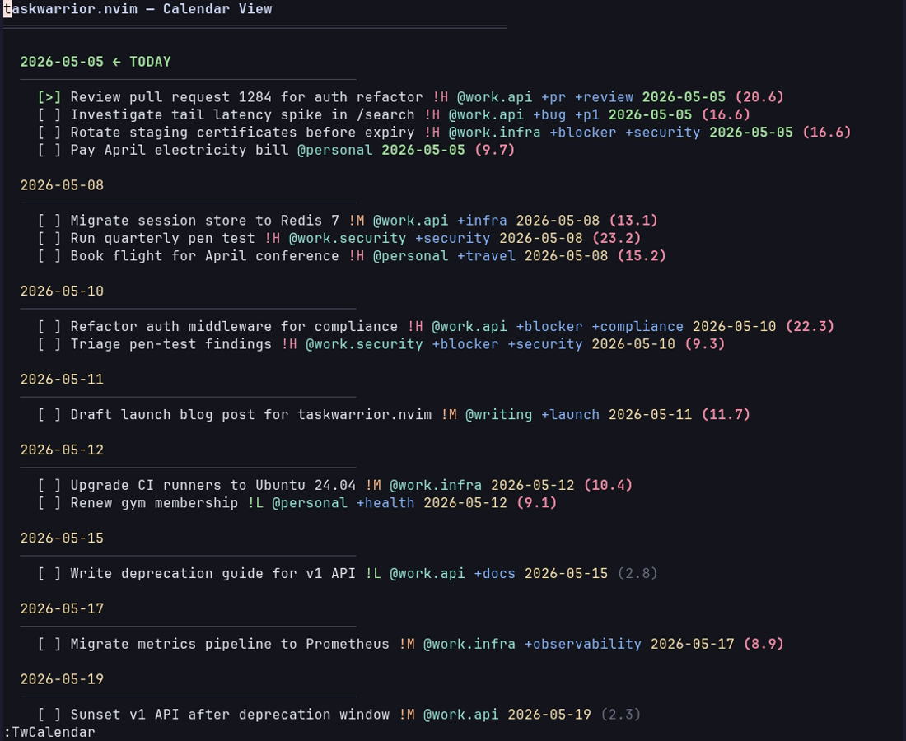
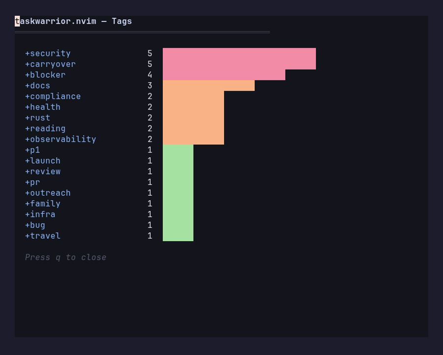
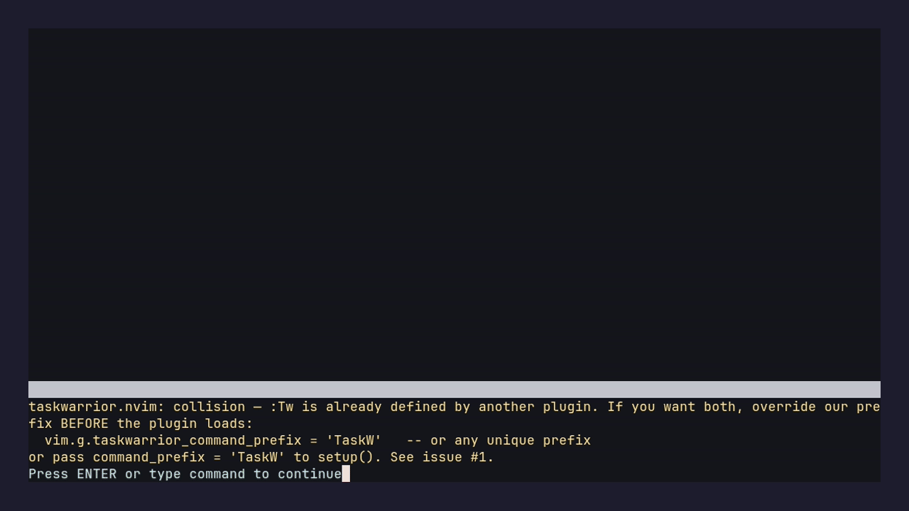

# 📋 taskwarrior.nvim

> Edit your Taskwarrior database like a Neovim buffer. Every vim motion, macro, and visual-mode operation becomes a task management operation. Inspired by [oil.nvim](https://github.com/stevearc/oil.nvim).

<p>
<a href="https://github.com/MattHandzel/taskwarrior.nvim/releases"></a>
<a href="https://github.com/MattHandzel/taskwarrior.nvim/commits/main"></a>
<a href="https://github.com/MattHandzel/taskwarrior.nvim/blob/main/LICENSE"></a>
<a href="https://github.com/MattHandzel/taskwarrior.nvim/stargazers"></a>
<a href="https://github.com/MattHandzel/taskwarrior.nvim/issues"></a>
</p>


## ✨ Features

- 📝 **Edit as markdown** — `:Tw` opens your Taskwarrior database as a buffer; every vim motion is a task operation
- ⚡ **Quick capture from any buffer** — `<leader>ta` floats a one-line capture in any buffer
- 🔍 **Live query blocks in arbitrary markdown** — `<!-- taskmd query: due.before:eow -->` renders matching tasks below it on save; embed live task lists in your project's `notes.md`
- 📊 **Built-in visualizations** — burndown, dependency tree, per-project summary, calendar, tag frequency, Mermaid graph
- 🎯 **Guided review + GTD inbox** — `:TwReview` walks pending tasks in urgency order; `:TwInbox` triages new captures
- 🤖 **Delegate to Claude** — `:TwDelegate` opens a popup form and runs the task as a Claude prompt in a bottom split
- 🎓 **Interactive tutor** — `:TwTutor` teaches Taskwarrior + the plugin from scratch in 20 minutes, fully sandboxed (your real `~/.task` is never touched)

## ⚡ Requirements

- Neovim ≥ 0.9
- Taskwarrior ≥ 2.6 (compatible with 3.x)

## 📦 Installation

```lua
-- lazy.nvim
{
  "matthandzel/taskwarrior.nvim",
  config = function()
    require("taskwarrior").setup()
  end,
}
```

## 🚀 Quick start

```
:Tw                          -- view all pending tasks
:Tw project:career +ais      -- filter
:Tw due.before:eow           -- tasks due this week
```

Edit any line. `:w` to sync. That's it.

## 🎓 New to Taskwarrior? Run the tutor

```
:TwTutor
```

A 5-lesson, ~20-minute interactive walkthrough that teaches the Taskwarrior CLI. Fully sandboxed.

Prefer video? Andrew Dumont's [Taskwarrior intro on YouTube](https://www.youtube.com/watch?v=5wmcn9-IQE4) is a great 5-minute primer; come back to `:TwTutor` after.

---

<details>
<summary><strong>📸 Showcase</strong> — visualizations, quick capture, guided review, delegation, diff preview</summary>

### Browse, filter, group



`:TwFilter project.startswith:work` narrows to a project. `:TwGroup project` splits the buffer into `## sections`. `:TwSort due+` re-sorts within groups. None of this touches your Taskwarrior database — only the view.

### Quick-capture from any buffer



`<leader>ta` pops a floating window in any buffer. Type `Fix auth bug project:work priority:H`, press Enter, go back to what you were doing. The task is in Taskwarrior before your hand leaves the keyboard.

### `:TwBurndown` — completion trend over time



ASCII bar chart of pending-task count by date. Reads `entry` and `end` dates from every task you've ever created, samples to fit the buffer width, color-codes by remaining height (red high → green low). Useful for "am I actually closing tasks faster than I'm opening them?"

### `:TwTree` — dependency graph



Renders `depends:` relationships as an indented tree. Top-level tasks are roots; `└──` and `├──` connectors show parentage. Urgency score on the right is color-coded (red ≥8, orange ≥4, green below). Dead-simple way to find the leaf tasks that are unblocking everything else.

### `:TwSummary` — per-project stats



For each project: pending count, done count, overdue count, high-priority count, and a horizontal bar. Bar color is red if any task is overdue, orange if any is high-priority, blue otherwise. Footer shows total completion rate.

### `:TwCalendar` — by due date



Pending tasks grouped by due date, ordered chronologically. Today is marked `← TODAY`, overdue dates marked `⚠ OVERDUE`. Tasks under each date show priority (`!H`/`!M`/`!L`) and project (`@name`).

### `:TwTags` — tag frequency



Every tag on every pending task with a count and frequency bar. Quick way to see which tags you're actually using vs. which were one-offs.

### `:TwReview` — guided urgency walk



Walks pending tasks in urgency order. For each task: `k` keep, `d` defer, `D` mark done, `m` modify, `g` jump to it in the main buffer, `q` quit. Useful for the "weekly tidy" pass where you want to look at every urgent task and decide what to do with it without opening a separate buffer.

### `:TwDelegate` — hand a task to Claude


Opens a popup form (extra context, flags, model, system-prompt-file) and runs Claude in a visible bottom split. Visual-range support: `V` to select multiple task lines, then `:TwDelegate` delegates them all in one Claude session. `:TwDelegate copy` and `:TwDelegate copy-command` copy the assembled prompt or the full shell invocation to the `+` register without spawning anything.

### `:TwDiffPreview` — see edits before you save


Toggle with `:TwDiffPreview on`. As you edit, virtual-text labels appear at end-of-line: `+ ADD`, `~ MODIFY`, `✓ DONE`, `✗ DELETE`, `▶ START`, `◼ STOP`. 400ms debounce keeps it from running on every keystroke. Same data the `:w` confirmation dialog uses — just shown live.

</details>

## Auto-project filter from cwd

Register the directories you work in:

```
:TwProjectAdd career      -- maps cwd to project:career
:TwProjectList            -- show all mappings
:TwProjectRemove          -- unmap cwd
```

After that, `:Tw` (with no filter) auto-applies `project:<name>` whenever you launch it from inside a registered directory. Persisted to `stdpath("data")/taskwarrior_nvim_projects.json`.

## Ecosystem

These are bundled but require their own host plugins.

| Module               | Path                                 | Activate                                                                                                                    |
| -------------------- | ------------------------------------ | --------------------------------------------------------------------------------------------------------------------------- |
| Telescope picker     | `lua/telescope/_extensions/task.lua` | `require("telescope").load_extension("task")` then `:Telescope task tasks`                                                  |
| nvim-cmp source      | `lua/taskwarrior/cmp.lua`            | `require("cmp").register_source("task", require("taskwarrior.cmp").new())` then add `{ name = "task" }` to your cmp sources |
| Statusline component | `lua/taskwarrior/statusline.lua`     | `require("taskwarrior.statusline").render()` — returns a string with the active task / overdue count / next due             |

## All commands

| Command                                                        | Description                                                                                                   |
| -------------------------------------------------------------- | ------------------------------------------------------------------------------------------------------------- |
| `:Tw [filter]`                                                 | Open task buffer with optional Taskwarrior filter                                                             |
| `:TwFilter [filter]`                                           | Change filter on current buffer                                                                               |
| `:TwSort <spec>`                                               | Change sort order (e.g. `due+`, `urgency-`, `priority-`)                                                      |
| `:TwGroup [field]`                                             | Change grouping (`project`, `tag`, or `none`)                                                                 |
| `:TwRefresh`                                                   | Reload from Taskwarrior                                                                                       |
| `:TwAdd`                                                       | Quick-capture a task (floating window)                                                                        |
| `:TwUndo`                                                      | Reverse last save's changes                                                                                   |
| `:TwHelp`                                                      | Show all commands, keybindings, syntax                                                                        |
| `:TwStart` / `:TwStop`                                         | Start / stop active timer on task under cursor                                                                |
| `:TwSave <name>` / `:TwLoad [name]`                            | Save / restore the current filter+sort+group as a named view                                                  |
| `:TwReview`                                                    | Guided urgency walk through pending tasks                                                                     |
| `:TwContext [name\|none]`                                      | Show or set the Taskwarrior context (task buffers honor its read filter)                                      |
| `:TwDelegate [copy\|copy-command]`                             | Delegate task(s) to Claude in a popup form                                                                    |
| `:TwDiffPreview [on\|off\|toggle]`                             | Toggle live virt-text diff preview                                                                            |
| `:TwBurndown`                                                  | Pending-task burndown chart                                                                                   |
| `:TwTree`                                                      | Dependency tree                                                                                               |
| `:TwSummary`                                                   | Per-project stats                                                                                             |
| `:TwCalendar`                                                  | Tasks grouped by due date                                                                                     |
| `:TwTags`                                                      | Tag-frequency view                                                                                            |
| `:TwTable [filter]`                                            | Vit-style column table; columns configurable via `table_columns`. `<CR>` opens that task for editing          |
| `:TwProjectAdd [name]` / `:TwProjectRemove` / `:TwProjectList` | Auto-project mapping                                                                                          |
| `:TwTutor [reset]`                                             | Open the interactive tutorial; `reset` ends an active session and cleans up orphan temp dirs                  |
| `:TwFeedback [last-error]`                                     | Open the structured bug-report form; `last-error` pre-fills with the most recent ERROR captured by the plugin |

## Keybindings (buffer-local)

| Key           | Action                                        |
| ------------- | --------------------------------------------- |
| `<CR>`        | Toggle task complete/pending                  |
| `o`           | New task below                                |
| `O`           | New task above                                |
| `dd`          | Delete task (marks done on save by default)   |
| `yy` + `p`    | Duplicate task                                |
| `ga`          | Add annotation                                |
| `gf`          | View formatted `task info`                    |
| `<leader>ta`  | Quick-capture (global, works from any buffer) |
| `<leader>tt`  | Open task buffer (global)                     |
| `<leader>tf`  | Change filter (in task buffer)                |
| `<leader>ts`  | Change sort (in task buffer)                  |
| `<leader>tg`  | Change group (in task buffer)                 |
| `<leader>tpa` | Register cwd as a project                     |

## Metadata syntax

Tasks use Taskwarrior-native syntax after the description:

```
- [ ] Fix login bug project:Work priority:H due:2026-04-01 +urgent +backend
```

**Fields:** `project:`, `priority:` (H/M/L), `due:`, `scheduled:`, `recur:`, `wait:`, `until:`, `effort:`, `depends:`

**Tags:** `+tagname` (supports hyphens: `+my-tag`)

**UDAs:** Custom fields are auto-discovered from your Taskwarrior config (`task _udas`) and serialized inline. Verified: render, edit, save round-trip on both backends.

## Configuration

```lua
require("taskwarrior").setup({
  on_delete = "done",          -- "done" or "delete" when lines are removed
  confirm = true,              -- show confirmation dialog before applying.
                               -- false = apply immediately on :w; the summary
                               -- notification then points at :TwUndo, which
                               -- reverts everything the save just did
  sort = "urgency-",           -- default sort (field+ for asc, field- for desc)
  group = nil,                 -- default group field (nil to disable)
  wrap = true,                 -- line-wrap task buffers (false = one line per task)
  fields = nil,                -- fields to show (nil = all)
  capture_key = "<leader>ta",  -- global quick-capture (nil to disable)
  open_key = "<leader>tt",     -- global open-task-buffer (nil to disable)
  filter_key = "<leader>tf",   -- buffer-local filter (nil to disable)
  sort_key = "<leader>ts",     -- buffer-local sort
  group_key = "<leader>tg",    -- buffer-local group
  project_add_key = "<leader>tpa",  -- register cwd as a project
  filters = {},                -- named filter presets (see :h)
  projects = {},               -- directory-to-project mapping
  icons = true,                -- nerd font checkbox/header icons
  border_style = "rounded",    -- "rounded" | "single" | "double" | "none"
  capture_width = nil,         -- quick-capture width (nil = auto)
  capture_height = 3,          -- quick-capture height in lines; line 1 is the
                               -- task, lines below it become annotations
  capture_annotations = true,  -- false = ignore everything below line 1
  table_columns = nil,         -- :TwTable columns; nil = built-in defaults.
                               -- Entries are field names or tables:
                               -- { field, label, width, align, format }.
                               -- Omit width on one column to let it absorb
                               -- the leftover space. Unknown fields fall
                               -- through to the task, so UDAs just work:
                               --   { "id", { field = "utility", width = 5,
                               --             align = "right" },
                               --     "description", "tags" }
  field_colors = {},           -- per-field highlight override, e.g.
                               -- { utility = "DiagnosticInfo" }. Fields not
                               -- listed still get the neutral TaskField group
  auto_backup = true,          -- copy ~/.task to stdpath("data")/taskwarrior.nvim/backups/ before apply
  auto_backup_keep = 10,       -- number of recent backups to retain
  delegate = {
    command = "claude",
    flags = "",                -- e.g. "--dangerously-skip-permissions" (opt-in)
    model = nil,
    system_prompt_file = nil,
    height = 0.5,
  },
})
```

### Custom urgency with UDAs

Custom feature from `taskwarrior.nvim`!

If you have custom UDA fields (e.g. `utility`, `effort`) and want them to affect task sort order, use `urgency_coefficients`. For each field, the urgency adjustment is **value × coefficient** — proportional to the actual numeric value, not just whether the field is present:

```lua
require("taskwarrior").setup({
  urgency_coefficients = {
    utility = 1.0,     -- utility:8 adds +8, utility:20 adds +20
    effort = -0.5,     -- effort:60 subtracts -30 (do easy wins first)
  },
})
```

The default is `{}` (no adjustments) — set only the fields you use.

For non-linear urgency (e.g. `log(utility)` or `utility / effort`), use `custom_urgency` — a Lua function that receives the full task table and returns a number:

```lua
require("taskwarrior").setup({
  custom_urgency = function(task)
    local base = task.urgency or 0
    local utility = tonumber(task.utility) or 0
    local effort = tonumber(task.effort) or 60
    return base + math.log(utility + 1) * 3 - math.sqrt(effort) * 0.1
  end,
})
```

## Health check

Run `:checkhealth taskwarrior` to verify your setup (Neovim version, Taskwarrior CLI, data directory).

## Data safety

> **Status: Beta.** Usable day-to-day, but APIs and defaults may still change. Always keep an external backup of your Taskwarrior data (`cp -r ~/.task ~/.task.bak`); review the confirmation dialog before saving — `:w` issues real `task modify` / `task done` / `task delete` commands.

`:w` issues real `task modify` / `task done` / `task add` / `task delete` commands against your Taskwarrior database. There is no staging.

By default (`auto_backup = true`), the plugin copies your Taskwarrior data directory to `stdpath("data")/taskwarrior.nvim/backups/<timestamp>/` immediately before any apply. The ten newest backups are kept; older ones are pruned. Disable with `auto_backup = false` in `setup()`.

## Help

Run `:help taskwarrior.nvim` inside Neovim for the full reference, or read [`doc/taskwarrior.txt`](doc/taskwarrior.txt). `:checkhealth taskwarrior` verifies your setup.

## Contributing

See [CONTRIBUTING.md](CONTRIBUTING.md). Quick version:

```bash
./tests/lua/bootstrap.sh           # 380+ Lua assertions via plenary
./tests/e2e/run.sh                 # end-to-end against real `task` binary
```

Every bug fix needs a regression test. The Lua suite covers parser/diff/render/save and every user-facing command; the e2e suite drives features against a real `task` CLI and validates downstream output (mmdc for Mermaid, `task export` for mutations, window state for floats).

## Changelog

See [CHANGELOG.md](CHANGELOG.md).

## License

MIT
